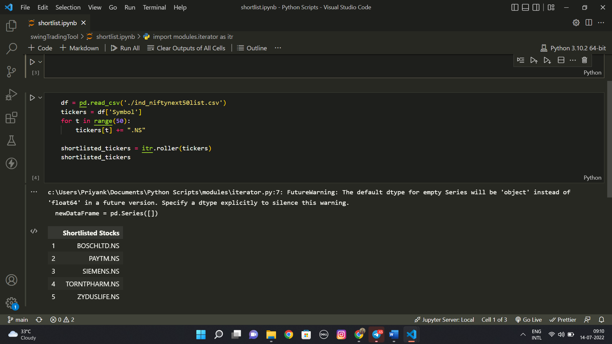
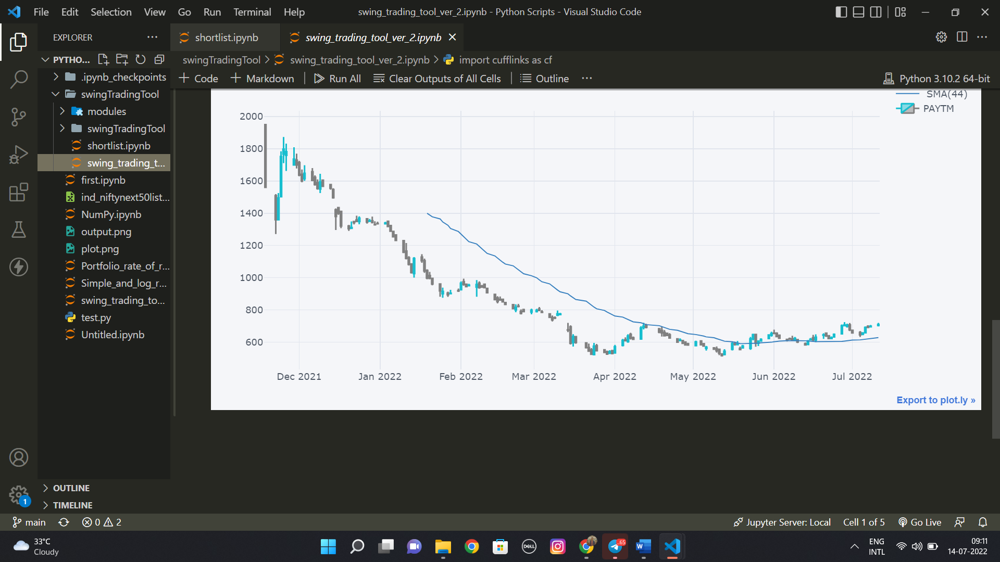

<h1>Swing Trading tool</h1>

 This tool works on the moving average support. The shortlist.ipynb file is to be executed which shortlist the stocks based on the past 10 days of moving average data . Then for tracking the support a swing_trading_tool_ver_2.ipynb is added which helps to track the support.

Based on the risk the user can decide the target, Quantity and stopLoss

<strong>Disclaimer - This tool by no means guarantee a profit trade, it is just for Analytical purposes.</strong>

Note - This tool only works on stocks listed in NSE, INDIA

Output of shortlist.ipynb

Output of swing_trading_tool_ver_2.ipynb

